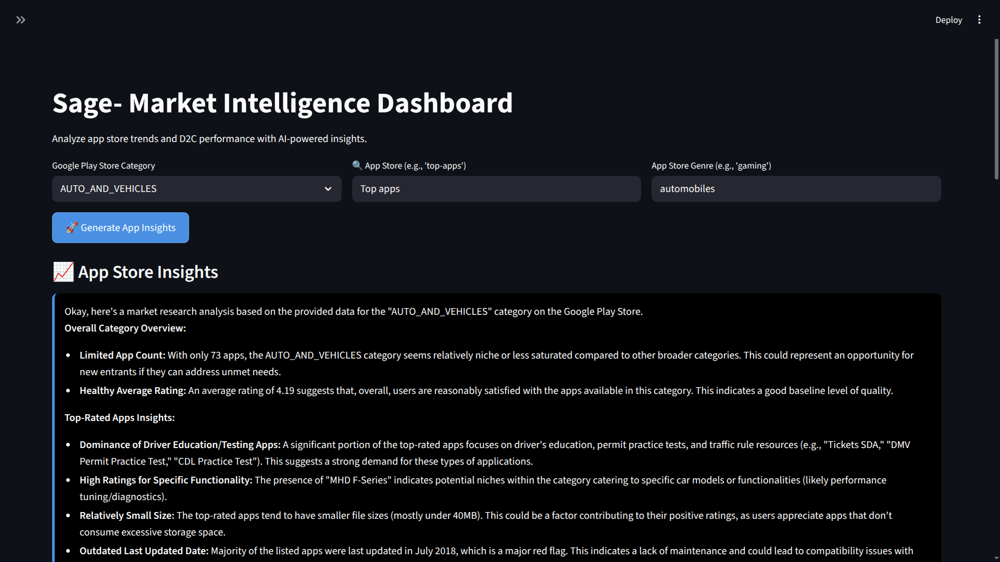

# Sage - Market Intelligence Dashboard

> *Unlock the power of AI to analyze app store trends and D2C eCommerce performance.*

Welcome to **Sage**, an intelligent market intelligence tool built to help product managers, marketers, and data analysts make faster, smarter decisions using real-time data from Google Play Store, App Store, and D2C e-commerce platforms.

With Sage, you can:
- Explore top-performing apps by category
- Compare user engagement across platforms
- Get AI-powered insights on market trends
- Run D2C analytics to optimize conversion funnels
- Generate reports in seconds

Built with Streamlit, LangChain, and Gemini, Sage turns raw data into actionable business intelligence — all in one clean, interactive dashboard.

---

## 🔍 What It Does

Sage combines:
- **Structured data** from Google Play Store (10k+ apps)
- **Real-time API data** from Apple App Store via RapidAPI
- **Synthetic D2C metrics** (ad spend, CAC, ROAS, SEO)
- **LLM-powered analysis** using Google Gemini

You can:
- Select any app category (e.g., "COMICS", "HEALTH_AND_FITNESS")
- Fetch top iOS apps by genre
- Get AI-generated summaries and recommendations
- Run D2C funnel analysis to identify growth opportunities

All outputs are saved as JSON or Markdown reports for sharing with stakeholders.

---

## 🛠️ Tech Stack

| Component | Technology |
|--------|------------|
| Frontend | [Streamlit](https://streamlit.io/) |
| LLM | [Google Gemini](https://ai.google.dev/gemini) |
| Data Ingestion | Pandas, Requests, RapidAPI |
| State Management | `st.session_state` |
| Code Structure | Modular Python packages (`sage/`) |
| Environment | `.env`, `requirements.txt` |

---

## 🚀 How to Run

1. Clone the repo:
   ```bash
   git clone https://github.com/yourusername/sage-market-intelligence.git
   cd sage
   ```

2. Create a virtual environment:
   ```bash
   python -m venv .venv
   source .venv/bin/activate  # Linux/Mac
   # or .venv\Scripts\activate  # Windows
   ```

3. Install dependencies:
   ```bash
   pip install -r requirements.txt
   ```

4. Set up environment variables:
   ```bash
   echo "RAPIDAPI_KEY=your_rapidapi_key" > .env
   echo "GEMINI_API_KEY=your_gemini_api_key" >> .env
   ```

5. Launch the app:
   ```bash
   streamlit run app.py
   ```

Open your browser at `http://localhost:8501` and start exploring!

---

## ✨ Features

### 📱 App Store Insights
- Filter by category (e.g., "COMICS", "FINANCE")
- View top-rated & most-installed apps
- Compare ratings, installs, and reviews
- Fetch top iOS apps via RapidAPI

### 💼 D2C eCommerce Analysis
- Analyze ad campaign performance (CAC, ROAS)
- Identify high-potential SEO categories
- Generate creative assets (ad headlines, meta descriptions)

### 🧠 AI-Powered Reports
- Natural language summaries of data
- Confidence scores for insights
- Exportable JSON & Markdown reports

---

## 🧩 Example Workflow

1. Choose **"COMICS"** as category
2. Click **"Generate App Insights"**
3. See AI-generated summary like:
   > *"The comics category has strong user engagement, with average rating of 4.5+. Top apps focus on digital reading and manga discovery. Consider launching a free-to-play comic reader with social sharing features."*
4. Click **"Run D2C Analysis"** to explore conversion funnels
5. Save results for team review

---

## 📝 Notes

- This is a prototype — production use requires rate-limiting, caching, and security.
- The D2C dataset is synthetic for demo purposes.
- All LLM responses are generated dynamically; no hard-coded outputs.

---
